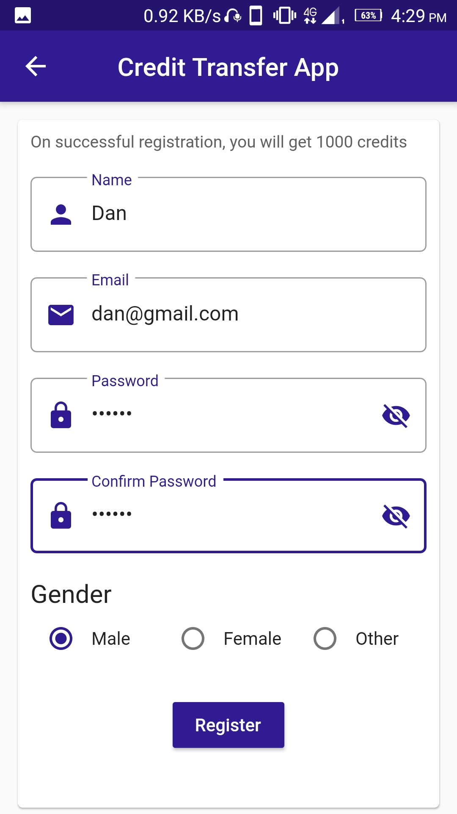

# Credit Transfer App (Flutter)

- In Credit Transfer App users can register themselves after which they will be provided with 1000 credits (points).
- The users can then login into the app and send credits to other users of the app.
- The user can also request other users for credit.
- On receiving a request from other users, the logged in user can either Approve or Decline the request.
- The user can keep track of all his transactions in the history section.
- There is also a feature of changing or removing the profile image of the user.
- The users also receive a notification after they receieve credits as well as after getting requests for transferring credit.
- This is a dummy project in Flutter which can be further extended for production purpose.
- For demo of this project, go to <b><i>https://www.youtube.com/watch?v=N5hxyKDqVyQ&feature=youtu.be</i></b> or <b><i>https://drive.google.com/drive/folders/1DJp3GWOqgovpB2LLzvy-uGL5Spmz8_Cc?usp=sharing</i></b> or refer <b><i>Flutter_Credit_Transfer_Demo.mp4</i></b>
- The APK file of the project is available in this repository. Refer <b><i>Flutter_Credit_Transfer.apk</i></b> file or go to <b><i>https://drive.google.com/drive/folders/1DJp3GWOqgovpB2LLzvy-uGL5Spmz8_Cc?usp=sharing</i></b>.

## Frontend and Backend Details

Flutter components used:-
- Rows, Columns, Buttons, TextFields
- Stream Provider for fetching details from database

Firebase services used for backend:-
- Firebase Authentication
- Firebase Database
- Firebase Storage
- Firebase Functions

## Screenshots
| | | |
|:-------------------------:|:-------------------------:|:-------------------------:|
||||
||||